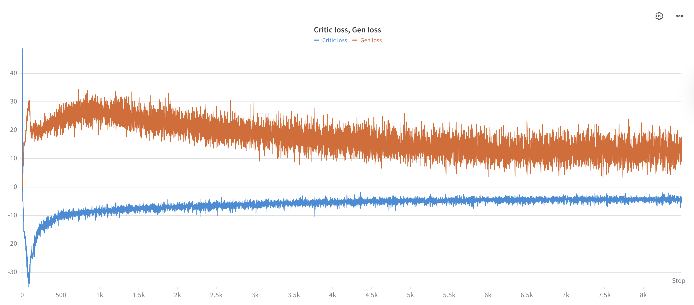

# GAN-for-celeb-faces
Implementation of GAN training for faces dataset CelebA

## Kaggle Notebook
Using Kaggle Notebook is highly recommended as it is easy to find and include datasets there. An added advantage is the availability of 2 T4 GPUS. 

## DataParallel from PyTorch
The training loop was implemented using DataParallel (DP) from PyTorch to make use of the 2 T4 GPUs available with Kaggle Notebook. An advanced imeplemented of multiple GPUs with DidtributedDataParallel (DDP) from PyTorch is possible from within Kaggle/Jupyter Notebooks and requires CLI access, which is unavailable with Kaggle Notebook. The DDP implementation is still available in the .ipynb file at the end, but has been commentd out.

## Weights-And-Biases
Also, setup an account on wandb.ai (Weights-And-Biases) to keep track of your runs remotely and compare performance of different training loop with various hyperparameters easily. 
A screenshot of a training cycle with generator and critic loss for combination of hyperparameters with 50000 images of the CelebA dataset is here:

